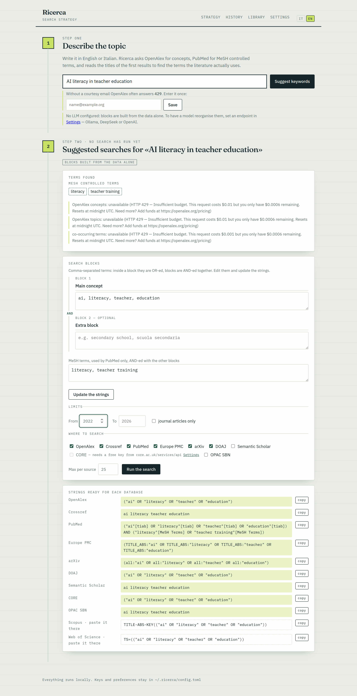

# Ricerca

**Italiano** · [English](#english)

Assistente di strategia di ricerca bibliografica. Da un argomento ricava
parole chiave, termini controllati e stringhe di ricerca pronte per ogni
banca dati, poi esegue le query ed esporta i risultati.



## Come funziona

1. **Argomento** — lo scrivi in italiano o in inglese.
2. **Ricerche suggerite** — concetti da OpenAlex, termini MeSH da PubMed,
   termini che ricorrono nei titoli dei primi risultati. Da questi nascono i
   blocchi booleani, modificabili a mano, e le stringhe per ogni motore.
   Nessuna ricerca parte finché non la avvii tu.
3. **Risultati** — le fonti scelte vengono interrogate in parallelo, i
   duplicati uniti per DOI o titolo (anche quando un titolo è troncato o
   punteggiato diversamente), l'elenco ordinato per pertinenza. Scegli quali
   campi mostrare, leggi come tabella o come **riferimenti APA**, scarica i
   **PDF ad accesso aperto**, esporta in `.bib`, `.csv`, `.txt`.
4. **Selezione** — ogni record si marca *incluso*, *forse* o *escluso* con un
   motivo; i conteggi seguono il diagramma di flusso PRISMA e il **protocollo**
   in Markdown raccoglie stringhe, numeri e decisioni per la sezione «Metodo».
5. **Cronologia** — ogni ricerca resta salvata con la sua strategia e i suoi
   record: si riapre, si riesporta e se ne scaricano i PDF senza ripeterla.
6. **Biblioteca** — i PDF scaricati sono cercabili a testo pieno.

Limiti di anno e «solo articoli di rivista» valgono per tutte le fonti,
ognuna con la propria sintassi. Le risposte restano in una cache locale di un
giorno: affinare una strategia non ribatte sulle API.

Motori interrogati: OpenAlex, Crossref, PubMed, Europe PMC, arXiv, DOAJ,
Semantic Scholar (meglio con chiave), CORE (chiave gratuita), OPAC SBN per i
libri italiani (tramite la CLI `opac-sbn-pp-cli`, se installata). Per Scopus e Web
of Science l'app produce la stringa da incollare nella loro interfaccia.

## Scarica e avvia

Dalla pagina [Releases](https://github.com/nugh75/Ricerca-scientifica/releases)
scarica l'archivio del tuo sistema, estrailo e avvia:

| Sistema | Archivio | Avvio |
|---|---|---|
| macOS | `ricerca-*-macos.tar.gz` | trascina **Ricerca.app** in Applicazioni; la prima volta clic destro → *Apri* |
| Windows | `ricerca-*-windows.zip` | doppio clic su `avvia.bat` — `crea-scorciatoia-windows.bat` mette l'icona sul Desktop |
| Linux | `ricerca-*-linux.tar.gz` | `./avvia.sh` — `installa-scorciatoia-linux.sh` la mette nel menu applicazioni |

Su macOS l'app è un vero bundle: si avvia dall'icona, **senza finestra di
Terminale**. Se macOS la dichiara «danneggiata» (succede agli archivi
scaricati e non firmati), una volta sola:

```bash
xattr -dr com.apple.quarantine /Applications/Ricerca.app
```

**Chiudendo la pagina del browser l'app si chiude da sola** entro una decina
di secondi: non resta nessun processo appeso e non serve un terminale per
fermarla. Per tenerla accesa anche a pagina chiusa: `ricerca serve --resta-aperto`.

**Non serve installare Python.** Al primo avvio il lanciatore scarica `uv`
dentro la cartella dell'app e con esso l'interprete e le librerie: nessun
permesso di amministratore, nessuna modifica al sistema, nessun `PATH` da
sistemare. Serve solo una connessione a internet la prima volta.

Se la cartella non è scrivibile (per esempio `/Applications` o
`Program Files`), l'ambiente viene creato in `~/.ricerca` e la cartella
dell'app resta intatta.

Poi si apre il browser su `http://127.0.0.1:8000` (o la prima porta libera).
Il server ascolta solo su `127.0.0.1`: non è raggiungibile da altre macchine.

Da terminale, se preferisci:

```bash
uv run ricerca serve          # oppure: pip install -e . && ricerca serve
```

Per costruire gli archivi: `./scripts/crea-release.sh` (finiscono in `dist/`).
In CI li produce `.github/workflows/release.yml` a ogni tag `v*`.

## Chiavi ed email: tutto dall'interfaccia

Dal 2026 OpenAlex misura le richieste a consumo: c'è un budget giornaliero
gratuito, oltre il quale risponde `429` spiegando che il credito è finito.
L'app mostra il messaggio così com'è e continua a lavorare con le altre
fonti. L'email di cortesia resta utile e viene spedita solo se è un
indirizzo valido: un `mailto` malformato fa rispondere `400`.

Nessuna chiave è obbligatoria e nessuna va scritta in un file a mano.
Dalla pagina **Impostazioni**:

- **email di cortesia** — OpenAlex la usa per concedere limiti di richiesta
  più larghi; senza, risponde spesso `429`. Si può inserire anche dalla
  pagina iniziale, al primo avvio;
- **chiave Semantic Scholar**, **chiave CORE**, **chiave NCBI/PubMed**;
- **chiave e libreria Zotero**, per spedire i record inclusi nella tua
  libreria con un bottone;
- **endpoint e modello LLM** (facoltativi: servono anche a tradurre un topic
  italiano prima di interrogare PubMed, che in italiano non trova i MeSH).

Le chiavi restano in `~/.ricerca/config.toml` con permessi `600`, non
vengono mai rimandate al browser e si cancellano con la spunta *rimuovi*.
Nella stessa cartella stanno la cronologia (`cronologia.json`) e i PDF
scaricati (`pdf/`).

## LLM (facoltativo)

Un endpoint compatibile con l'API OpenAI — Ollama
(`http://localhost:11434/v1`), DeepSeek, OpenAI. Serve solo a
riorganizzare i termini in blocchi concettuali: senza, l'app costruisce i
blocchi dai soli dati e funziona lo stesso.

## Lingua

L'interfaccia parte in inglese e si porta in italiano con i pulsanti
`IT` / `EN` in alto a destra: la scelta resta memorizzata.

## Sviluppo

```bash
uv venv && uv pip install -e ".[dev]"
.venv/bin/pytest -q                     # 157 test, nessuno tocca la rete
.venv/bin/pytest -m rete tests/contratto  # controlla le API vere (CI settimanale)
.venv/bin/uvicorn ricerca.app:app --reload --port 8000
```

Un solo pacchetto Python: FastAPI rende HTML con Jinja2, htmx aggiorna i
frammenti di pagina. Niente Node, niente build, niente binari da firmare.

- `ricerca/keywords.py` — estrazione dei termini dalle banche dati
- `ricerca/strategy.py` — blocchi booleani e resa per motore
- `ricerca/sources/` — un modulo per motore, interfaccia unica
- `ricerca/search.py` — esecuzione parallela con isolamento degli errori
- `ricerca/history.py` — cronologia delle ricerche in JSON
- `ricerca/pdf.py` — scaricamento dei PDF ad accesso aperto
- `ricerca/export.py` — BibTeX, CSV e riferimenti APA
- `ricerca/watchdog.py` — chiusura automatica quando la pagina si chiude
- `ricerca/cache.py` — cache SQLite delle risposte, come trasporto httpx
- `ricerca/zotero.py` — invio dei record inclusi a Zotero
- `ricerca/biblioteca.py` — testo dei PDF e ricerca a testo pieno
- `ricerca/i18n.py` — stringhe italiane e inglesi
- `docs/specs/` — il documento di progetto

---

# English

A literature search strategy assistant. From a topic it derives keywords,
controlled vocabulary terms and ready-made query strings for each database,
then runs the queries and exports the results.

## How it works

1. **Topic** — write it in English or Italian.
2. **Suggested searches** — concepts from OpenAlex, MeSH terms from PubMed,
   terms recurring in the titles of the first results. These become editable
   boolean blocks and one query string per engine. No search runs until you
   start it.
3. **Results** — sources are queried in parallel, duplicates merged by DOI or
   title (even when one title is truncated or punctuated differently), the
   list ranked by relevance. Pick the fields, read it as a table or as **APA
   references**, download **open-access PDFs**, export to `.bib`, `.csv`, `.txt`.
4. **Screening** — mark each record *include*, *maybe* or *exclude* with a
   reason; the counters follow the PRISMA flow diagram and the **protocol** in
   Markdown gathers strings, numbers and decisions for your Methods section.
5. **History** — every search is stored with its strategy and its records:
   reopen it, export it again, fetch its PDFs without running it twice.
6. **Library** — the downloaded PDFs are searchable in full text.

Year limits and “journal articles only” apply to every source, each in its own
syntax. Responses are cached locally for a day: refining a strategy does not
hammer the APIs.

Sources queried: OpenAlex, Crossref, PubMed, Europe PMC, arXiv, DOAJ, Semantic
Scholar (better with a key), CORE (free key), OPAC SBN for Italian books
(through the `opac-sbn-pp-cli` CLI, if installed). For Scopus and Web of Science the app
produces the string to paste into their own interface.

## Download and run

Grab the archive for your system from the
[Releases](https://github.com/nugh75/Ricerca-scientifica/releases) page,
extract it and start it:

| System | Archive | Start |
|---|---|---|
| macOS | `ricerca-*-macos.tar.gz` | drag **Ricerca.app** into Applications; first launch, right-click → *Open* |
| Windows | `ricerca-*-windows.zip` | double-click `avvia.bat` — `crea-scorciatoia-windows.bat` puts an icon on the Desktop |
| Linux | `ricerca-*-linux.tar.gz` | `./avvia.sh` — `installa-scorciatoia-linux.sh` adds it to the applications menu |

On macOS it is a real app bundle: it starts from its icon, **with no Terminal
window**. If macOS calls it “damaged” (which happens with unsigned downloaded
archives), run once:

```bash
xattr -dr com.apple.quarantine /Applications/Ricerca.app
```

**Closing the browser page quits the app** within about ten seconds: no
process left behind, no terminal needed to stop it. To keep it running:
`ricerca serve --resta-aperto`.

**Python is not required.** On first run the launcher downloads `uv` into the
app folder and lets it fetch the interpreter and the libraries: no admin
rights, no system changes, no `PATH` edits. Only an internet connection the
first time.

If the folder is read-only (say `/Applications` or `Program Files`), the
environment is created under `~/.ricerca` and the app folder is left
untouched.

The browser then opens at `http://127.0.0.1:8000` (or the first free port).
The server listens on `127.0.0.1` only.

From a terminal instead:

```bash
uv run ricerca serve          # or: pip install -e . && ricerca serve
```

## Keys and email: all from the interface

No key is required, and none has to be written into a file by hand. On the
**Settings** page you can set the courtesy email (OpenAlex grants higher rate
limits with it; without it, it often answers `429`), the Semantic Scholar,
CORE and NCBI keys, and an optional LLM endpoint and model.

Keys are stored in `~/.ricerca/config.toml` with `600` permissions, are never
sent back to the browser, and can be deleted with the *remove* checkbox.

## Language

The interface starts in English; the `IT` / `EN` buttons in the header switch
it to Italian. The choice is remembered.
